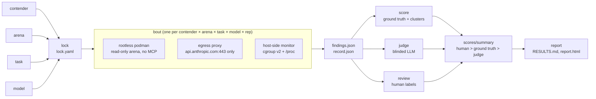

# skillordeal

[](https://github.com/thereisnotime/skillordeal/actions/workflows/ci.yml)

A reproducible benchmark harness for LLM agent skills (`SKILL.md` packs, Claude Code plugins, plain prompts): give it a skill, a pinned codebase and a task, and it runs the agent with nothing else in context and records what came out.

- **Isolation:** every bout runs in a fresh rootless podman container with a read-only arena, no MCP servers, no host config, and network access only to `api.anthropic.com:443` through a per-bout proxy. An isolation gate throws out bouts that loaded anything unexpected.
- **Locking:** image digest, CLI version, skill and arena commits, full model IDs and prompt hashes are pinned in a `lock.yaml`. `run` refuses to start on drift, and bout IDs are hashes of their inputs, so rounds resume.
- **Resource metrics:** tokens, cost, turns and wall time per bout, plus 1 s samples of the client's RSS, threads, file handles and CPU.
- **Four ways to score:** ground-truth matching, duplicate clustering across contenders, a blinded LLM judge, and blind human review in a local browser UI.
- **Reports:** `RESULTS.md` with bootstrap CIs, deltas against the baseline and cost per true positive, plus SVG charts and mermaid diagrams that GitHub renders; a self-contained `report.html`; and CSV/parquet exports.

It starts with Claude Code. Other agent CLIs can be added behind `src/skillordeal/adapters/`.

This repo is the **engine**. Studies, their locks, ground truth, human labels and results live in [skillordeal-trials](https://github.com/thereisnotime/skillordeal-trials), which pins a released engine version.

## Contents

- [How it works](#how-it-works)
- [Words used everywhere](#words-used-everywhere)
- [Quick start](#quick-start)
- [What a result looks like](#what-a-result-looks-like)
- [Auth](#auth)
- [What "zero context" means here](#what-zero-context-means-here)
- [Pipelines](#pipelines)
- [Locking](#locking)
- [Limits](#limits)
- [What a bout leaves behind](#what-a-bout-leaves-behind)
- [Scoring](#scoring)
- [Judge](#judge)
- [Review](#review)
- [Report](#report)
- [Triage](#triage)
- [Development](#development)

## How it works



Each box is one CLI command (`lock`, `run`, `score`, `judge`, `review`, `report`), and each step only talks to the next through files on disk, so any step can be re-run on its own. The files are specified in [docs/data-contracts.md](docs/data-contracts.md).

## Words used everywhere

| Term | Meaning |
|---|---|
| **Trial** | One study: a question plus a fixed design (`trial.yaml`). Example: `2026-09-secure-coding-audit`. |
| **Round** | One locked execution of a trial (`rounds/r01/lock.yaml`). Reproductions add new rounds. |
| **Contender** | A skill under test, or `baseline` (no skill). Kinds: `skill`, `plugin`, `prompt`, `baseline`, `pipeline`. |
| **Arena** | A target repo pinned to a commit, optionally with ground truth. |
| **Task** | A prompt template, e.g. `security-audit`. |
| **Bout** | One run: contender × arena × task × model × rep. Its ID is a hash of its locked inputs. |

## Quick start

You need:

- [asdf](https://asdf-vm.com), which installs the pinned `uv`, `nodejs`, `gitleaks` and `actionlint` from `.tool-versions`
- [just](https://github.com/casey/just)
- rootless podman on cgroup v2 (the resource monitor reads the container's cgroup)
- [uv](https://docs.astral.sh/uv/), if you don't let asdf install it; it pulls Python 3.14 for the venv
- a Claude credential (see [Auth](#auth))

```bash
just setup           # asdf install + uv sync (venv in .venv)
just image           # build the runner image locally with podman (localhost/skillordeal-runner:dev)
just doctor          # check podman, cgroup v2, rootless, image, uv, auth env
just smoke           # lock + run examples/smoke on Haiku: 3 bouts, about $0.65
```

`just image` builds `container/Containerfile` locally from a pinned base image digest and installs the pinned Claude Code CLI version from npm. The smoke trial uses that local tag; `release-image.yml` publishes `ghcr.io/thereisnotime/skillordeal-runner:<tag>` for each `v*` tag, which real trials pin. `just` with no arguments shows the menu. Every recipe is one plain command, so the same steps without just are:

```bash
uv run skillordeal validate   examples/smoke/trial.yaml
uv run skillordeal lock       examples/smoke/trial.yaml -r smoke
uv run skillordeal plan       examples/smoke/trial.yaml -r smoke
uv run skillordeal run        examples/smoke/trial.yaml -r smoke -j 2 --max-cost-usd 2
uv run skillordeal status     examples/smoke/trial.yaml -r smoke
uv run skillordeal show       examples/smoke/rounds/smoke/bouts/<bout-id>
uv run skillordeal transcript examples/smoke/rounds/smoke/bouts/<bout-id> | jq .
```

`-j` defaults to `runtime.concurrency` (1). Smoke round output lands in `examples/smoke/rounds/`, which is gitignored.

## What a result looks like

An excerpt of `examples/smoke/rounds/smoke/RESULTS.md` after `run`, `score`, `judge` and `report`. It's a 1-rep smoke test on Haiku, so it shows the plumbing works, not which skill is better.

**Quality** (dvpwa · security-audit · `claude-haiku-4-5-20251001`)

| contender | n | findings | TP | recall | judge-valid | bouts |
|---|---|---:|---:|---:|---:|---|
| baseline | 1/1 | 7 | 6 | 0.32 | 7 | #1 |
| sentry-security-review | 1/1 | 6 | 6 | 0.32 | 6 | #1 |
| sentry-then-fp-check | 1/1 | 6 | 6 | 0.32 | 6 | #1 |

**Against baseline**

| contender | Δ TP | Δ F1 | Δ cost $ | cost per TP $ | skill fired | first-turn tokens vs baseline | check |
|---|---:|---:|---:|---:|---:|---:|---|
| sentry-security-review | 0 | n/a | -0.028 | 0.022 | 100% (n=1) | +4,018 | ok |
| sentry-then-fp-check | 0 | n/a | +0.177 | 0.056 | 100% (n=1) | +4,018 | ok |

Δ F1 is `n/a` because dvpwa's ground truth isn't marked complete, so only a lower bound on precision exists. With one rep there are no confidence intervals. The full file also has a cost and resources table, the lock hash and versions, the bouts that didn't finish `ok`, and a reproduce snippet. See [Report](#report).

## Auth

Secrets are only ever referenced by variable **name**. Values are handed to podman through its environment (`-e NAME`), so they never show up in argv, `ps`, logs or artifacts. Every artifact also passes through a scrubber before it is written.

| `runtime.auth.mode` | What the container gets |
|---|---|
| `api_key` | `ANTHROPIC_API_KEY` (from `token_env`, default `ANTHROPIC_API_KEY`). Runs with `--bare`. |
| `oauth` | `CLAUDE_CODE_OAUTH_TOKEN` (from `token_env`), e.g. a long-lived `claude setup-token` token. |
| `credentials_file` | A copy of `~/.claude/.credentials.json` in the bout's throwaway config dir. Nothing else from `~/.claude` is mounted. |

To use a personal token without writing it into a committed trial, override the source for one run:

```bash
SKILLORDEAL_TOKEN_ENV=WORK_CLAUDE_CODE_OAUTH_TOKEN \
SKILLORDEAL_ENV_FILE=~/.config/secrets/claude.env \
  uv run skillordeal run trials/…/trial.yaml -r r01
```

## What "zero context" means here

Each bout runs in a fresh rootless podman container with:

- **Filesystem:** a read-only root filesystem, a tmpfs `HOME`, and a new empty `CLAUDE_CONFIG_DIR`. Auto-memory, telemetry and auto-updates are off.
- **Claude Code flags:** `--restricted`, `--strict-mcp-config` with an empty MCP config, `--no-session-persistence`, and either `--bare` (API key) or `--setting-sources ""` (OAuth).
- **The arena:** mounted read-only, with `.git` removed. Agent context files (`CLAUDE.md`, `CLAUDE.local.md`, `AGENTS.md`, `GEMINI.md`, `.claude/`, `.mcp.json`, `.cursorrules`, `.cursor/`, `.github/copilot-instructions.md`) and the arena's own `strip:` globs are deleted at any depth.
- **The contender:** a read-only `--plugin-dir`. Plain skills and prompts are wrapped in a neutral `ordeal` plugin, so delivery is the same in every auth mode.
- **Network:** an internal-only podman network. The one way out is a per-bout proxy sidecar that tunnels only to hosts in `runtime.network.allow` (default `api.anthropic.com`) on port 443. Every allowed and denied connection is counted in `record.json` under `egress`, so a skill that tries to phone home shows up there. Set `runtime.network.mode: open` only for debugging.
- **Tools:** read-only by default (`Read, Grep, Glob, Bash(git log|show, ls, wc), Skill`). There are no write tools.
- **Output:** the only writable path is `/out`. The agent writes its report to `/out/findings.json` (the prompt ends with engine-owned instructions and the schema) and the engine validates it. Structured output through the CLI was dropped for bouts because long nested reports sometimes came back mangled.
- **Plugin hooks** that ship with a contender (for example Trail of Bits fp-check's Stop hooks, which demand its full method before the agent may finish) run as part of that contender. They count toward its cost and time.

The **isolation gate** reads the CLI's `system/init` event. It marks the bout `invalid` (and excludes it from scoring) if any of these hold:

- the loaded skills differ from what the contender should provide
- any MCP server is present
- a plugin appears that shouldn't
- the model isn't the locked model ID

Skills and plugins that the CLI always loads (currently `design`, `doctor`, `telemetry`) are found by an offline probe at lock time and stored in the lock.

## Pipelines

A `pipeline` contender chains other contenders from the same contenders file: stage 1 does the task, and every later stage gets the previous stage's findings and verifies them. It measures "finder + independent verifier" against a single pass.

```yaml
contenders:
  - id: sentry-security-review
    kind: skill
    repo: https://github.com/getsentry/skills
    subpath: skills/security-review
    role: finder
  - id: tob-fp-check
    kind: plugin                      # ships its own sub-agents, so load the whole plugin
    repo: https://github.com/trailofbits/skills
    subpath: plugins/fp-check
    role: verifier
  - id: sentry-then-fp-check
    kind: pipeline
    stages: [sentry-security-review, tob-fp-check]   # 2+ stages; `baseline` = plain verifier pass
```

With `contenders: [sentry-security-review, sentry-then-fp-check]` in `trial.yaml` you get the finder alone and the finder plus verifier, both against the baseline. A stage only used inside a pipeline (`tob-fp-check` here) is still locked, but gets no bouts of its own.

- **Config:** a pipeline has only `stages` (plus `role`, `license`, `notes`); `repo`, `path`, `skill_name`, `strip` and `extra_tools` belong on the stages. Stage ids must exist in the same file or be `baseline`, and a stage can't be a pipeline itself, which also rules out cycles.
- **Stages:** each one is a normal bout run in a fresh container with its own skill, config dir, egress proxy, monitor and limits (`runtime.limits` and the model budget apply **per stage**). The isolation gate checks every stage against that stage's expected skills. Stage 2+ gets `src/skillordeal/prompts/verify.md` with the previous findings as fenced JSON, blinded like the judge's input (contender, skill and bout names redacted). It keeps the ones it can confirm in the code, may fix file/lines, and answers in the same findings schema.
- **Outcome:** the first stage that doesn't finish `ok` ends the bout with its status, and `failed_stage` says which. If stage 1 finds nothing, later stages are `skipped`.
- **Lock:** the pipeline's entry carries a copy of each stage's lock entry. Its `run_hash` (and so its bout IDs) covers the stages' run hashes in order plus the verify prompt hash, so editing a stage or `verify.md` re-runs only the pipeline bouts.
- **Record:** usage, cost, tokens, duration and turns are summed over stages, so `score` and `report` treat a pipeline like any contender. `findings_before_verify` is stage 1's count, and `bouts.csv` gets `stages` and `findings_before_verify` columns.

## Locking

`skillordeal lock` writes `rounds/<round>/lock.yaml` with:

- the engine version
- the image ID and digest, and the CLI version inside the image
- the built-in skills and plugins found by the probe
- full model IDs (aliases like `opus` are rejected)
- each contender's commit and a tree hash of exactly what gets mounted
- each arena's commit
- task prompt hashes and the findings schema hash

`run` recomputes all of it and refuses to start on drift. Bout IDs derive from the locked inputs, so re-running a round skips bouts that are already done. Adding a contender doesn't change the IDs of the other bouts.

## Limits

These are per bout and set under `runtime.limits`. Hitting one ends the bout with `limit_exceeded` or `timeout`, and the partial transcript is kept.

| Limit | Default | Enforced by |
|---|---|---|
| `cpus`, `memory`, `pids` | 2, 4g, 1024 | cgroup (podman) |
| `timeout_s` | 1800 | harness kills the container |
| `max_total_tokens` | 3,000,000 | harness watches the stream |
| `max_turns` | 200 | harness watches the stream |
| `max_output_tokens` | unset | `CLAUDE_CODE_MAX_OUTPUT_TOKENS` |
| model `max_budget_usd` / arena `budget_usd` | 5.0 | `--max-budget-usd` |

Round-wide ceilings: `run --max-cost-usd X --max-tokens N`.

## What a bout leaves behind

```text
rounds/<round>/bouts/<bout-id>/
  record.json            versions, hashes, status, usage per model, cost, turns, tool calls,
                         skill fired, first-turn prompt tokens, resource summary, limits, egress
  findings.json          structured output (schemas/findings.schema.json)
  prompt.md              exact prompt sent
  resources.jsonl        1 s samples: per-process RSS/threads/fds/CPU + cgroup totals
  transcript.jsonl.zst   full stream-json, scrubbed
  stderr.log
  stages/<n>-<contender>/  pipeline bouts only: the same files per stage
```

For a pipeline bout the top-level `findings.json` is the last stage's output, and `prompt.md`, `transcript.jsonl.zst`, `stderr.log` and `resources.jsonl` are copies of stage 1's.

Resource numbers describe the **client harness** (the CLI, node, and the tools it spawns), not model-side compute. They're sampled from the host, so nothing inside the container can see or change them.

## Scoring

```bash
uv run skillordeal score examples/smoke/trial.yaml -r smoke        # or: just score TRIAL ROUND
```

`score` reads every bout of a round and writes `rounds/<round>/scores/`. It makes no network calls and can be re-run at any time:

- `findings.jsonl` has one row per finding of every `ok` bout, with a stable `finding_id` and `finding_hash`. `bouts.csv` has one row per bout whatever its status (tokens, cost, time, turns, RAM/threads/fds/CPU).
- If the arena has a `groundtruth.yaml`, each finding is matched against it (`gt_matches.jsonl`), giving tp/dup/fp/unknown, precision, recall and f1 per bout. Unless the ground truth is marked `complete`, unmatched findings are `unknown` and only a lower bound on precision is reported.
- Findings about the same problem are clustered across all bouts of an arena. `unique.csv` counts, per contender, the distinct problems it found and how many of those no other contender found.
- `summary.parquet` / `summary.csv` merge it all with judge verdicts and human labels (`labels/labels.jsonl`). A human label beats ground truth, which beats the judge. The parquet file needs the `analysis` extra (`uv sync --extra analysis`).

## Judge

```bash
uv run skillordeal judge trials/…/trial.yaml -r r01 --dry-run      # print batches + prompts, free
uv run skillordeal judge trials/…/trial.yaml -r r01 --max-cost-usd 3
```

The judge is the model set as `judge:` in `trial.yaml`. It rules on every finding of the round that isn't in its cache yet, including ones ground truth already settled; in the summary, ground truth still wins over it. It runs in the same runner image and sandbox as a bout, with the arena mounted read-only and only `Read`, `Grep` and `Glob` available. It's asked to open the cited code, be skeptical, require attacker-controlled input for security findings, and reject hardening-only advice. The prompt is `src/skillordeal/prompts/judge.md`, and verdicts are `valid`, `invalid` or `unverifiable`.

- **Blinded:** the judge only sees file, lines, category, CWE, title, description and evidence. Contender and skill names and bout IDs are redacted from the text, and findings from all contenders are shuffled together (deterministically) in batches of `--batch-size` (default 15) per arena.
- **Cached:** verdicts are stored per judge model, prompt hash and `finding_hash` under `~/.cache/skillordeal/judge/`, so a finding is judged once across all rounds, and a re-run only pays for what's new.
- **Bounded:** `--max-cost-usd` stops judging once the spend reaches it, and each call's `--max-budget-usd` is capped to what's left. Each call leaves its prompt, record and scrubbed transcript under `scores/judge_runs/`.

`judge` writes `scores/judge.jsonl` and then re-runs `score`.

## Review

```bash
uv run skillordeal review trials/…/trial.yaml -r r01 [--labeler NAME] [--port 8765] [--show-contenders]
```

Starts a local server on `127.0.0.1` and prints a URL with a one-time token. The page shows one finding at a time with its description, evidence and recommendation, the cited code (±15 lines, from the same stripped export the agent saw), and the ground-truth and judge verdicts from `scores/`. Keys: `t` true positive, `f` false positive, `d` duplicate, `u` unsure, `j`/`k` next/previous, `/` search. You can link a verdict to a ground-truth issue from the arena's `groundtruth.yaml`.

Reviews are **blind by default**: contender, bout and rep are left out of what the page receives. Findings are ordered by file and line, so contenders are interleaved and likely duplicates sit next to each other.

Each verdict is appended to `<trial>/labels/labels.jsonl`. Nothing is rewritten; a later line for the same `finding_hash` and labeler overrides an earlier one. If `scores/findings.jsonl` doesn't exist yet, findings are read straight from the bouts (with no gt/judge badges).

## Report

```bash
uv sync --extra analysis
uv run skillordeal report trials/…/trial.yaml -r r01 [--markdown-only] [--no-charts]
```

Reads `scores/summary.parquet` (or `summary.csv`, or just `bouts.csv`) and writes into the round directory:

- `RESULTS.md`: renders on GitHub. It has the trial question, lock hash, engine/CLI/image versions and models, then per arena × task × model tables. Each cell is the mean over ok bouts with a 95% bootstrap CI (fixed seed, `--seed`/`--resamples`), and **n** (ok bouts over all bouts) sits next to it. It also shows Δ vs baseline, cost per TP, skill-fired rate and the forced-injection check. That check is first-turn prompt tokens minus the baseline's mean; zero or less gets flagged as "skill may not have loaded". Every contender row links its `bouts/<id>/` dirs, and every bout that didn't finish `ok` is listed with its reason. A "How to reproduce" snippet comes last. Above the tables it has a "Round at a glance" mermaid flowchart (bouts planned, how each status ended, findings and their verdicts), a per-stage flow for pipeline contenders, and a "Charts" section that embeds the files below.
- `charts/*.svg`: standalone matplotlib charts, byte-identical on re-run. Per arena: `quality-vs-cost-<arena>.svg` (TP, or judge-valid without ground truth, against cost, with CIs and the Pareto frontier), `findings-breakdown-<arena>.svg` (findings per bout stacked by verdict, so noise is visible) and `delta-vs-baseline-<arena>.svg`. For the round: `recall-by-contender.svg`, `cost-tokens.svg` and `resources.svg`. A chart with no data behind it isn't written or linked. Backgrounds are transparent and the colors are picked to read on both GitHub themes. GitHub won't render inline `<svg>` in markdown, so the trials repo commits `charts/` next to `RESULTS.md` and the images show up when you browse a round. `--no-charts` skips them.
- `report.html`: one self-contained file, no network. It inlines the same charts, recolored to follow light/dark mode, with hover titles. Tables are sortable. Skipped with `--markdown-only`.
- `results.csv` and `results.parquet`: the aggregated table, with means, CI bounds and deltas.

## Triage

```bash
uv run skillordeal triage [--skills-list ~/Private/Projects/P/skills-collection/skills-list.json] \
    [-k security -k "code review" ...] [--min-words 200] [--top 30] [--pin-synced] [--out candidates.yaml]
```

Shortlists contenders from a [skills-collection](https://github.com/thereisnotime/skills-collection) checkout without calling any model:

1. Matches keywords against name and description. The default list is about security and code review.
2. Drops SKILL.md files under `--min-words`.
3. Folds near-duplicates. Skills whose SKILL.md is identical once the frontmatter, case and whitespace are ignored count as one, and the best-scoring copy is kept.
4. Ranks with a score whose parts are written into each entry's notes: 3 per keyword hit, up to 3 for length, 2 for a `references/` dir, and log10(stars + 1) from `repos-meta.json`.

The output is a `contenders:` YAML in the engine's schema. Entries use `repo` + `subpath` on GitHub; `ref` is left out so `lock` pins the default branch, or it's set to the synced commit with `--pin-synced`. Skills not on GitHub get a local `path`. Each entry also carries a static risk pre-scan: `scripts/` files, `curl`/`wget`/`nc`/`/dev/tcp`/`base64 -d`/`eval`, URLs to non-GitHub hosts, and prompt-injection phrases. Hits are tagged `[code]` or `[doc]` and summed up as none/low/medium/high. It's a grep, not a verdict, so read the skill before you trust it.

## Development

```bash
just test          # unit tests (no podman, no API)
just test-podman   # plus podman integration tests
just lint
just verify        # lint + tests + gitleaks; run before pushing
```

Specs and changes are tracked with [OpenSpec](https://openspec.dev) under `openspec/`.

## License

Apache-2.0, see [LICENSE](LICENSE). Skills and target repos used in trials are only referenced by commit and keep their own licenses.
